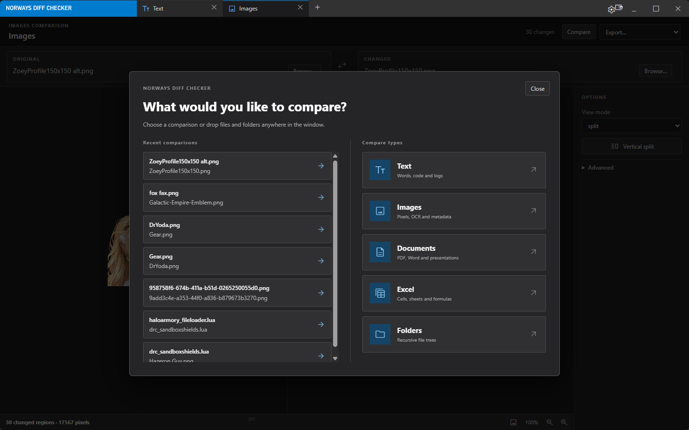
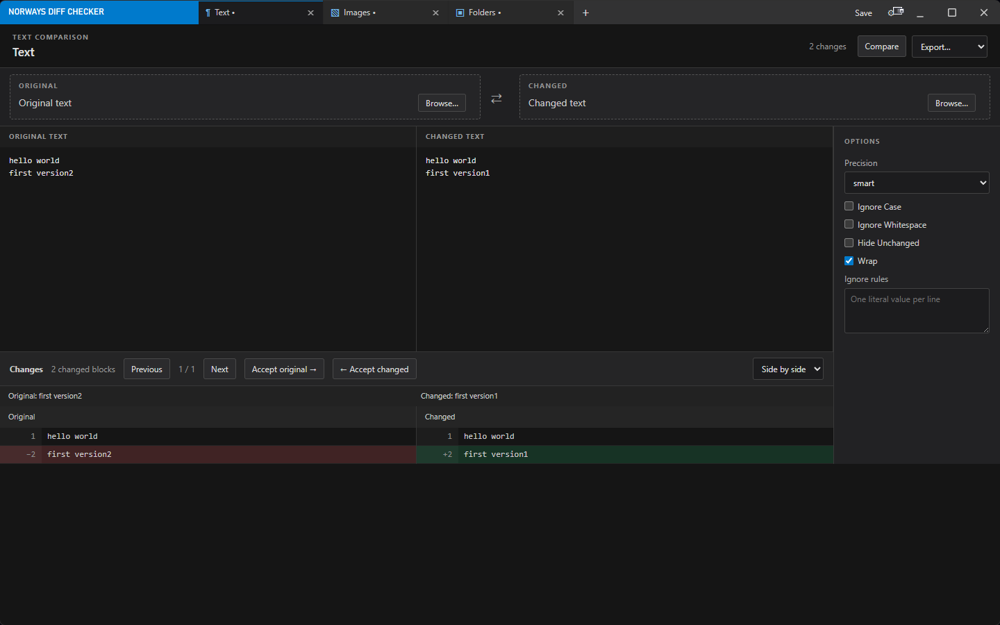
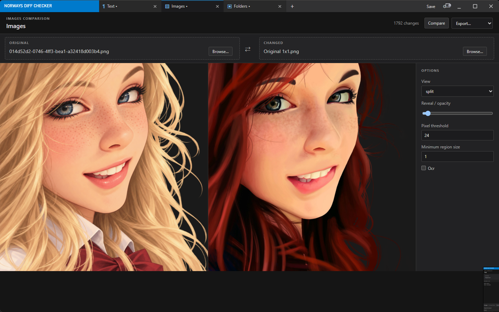
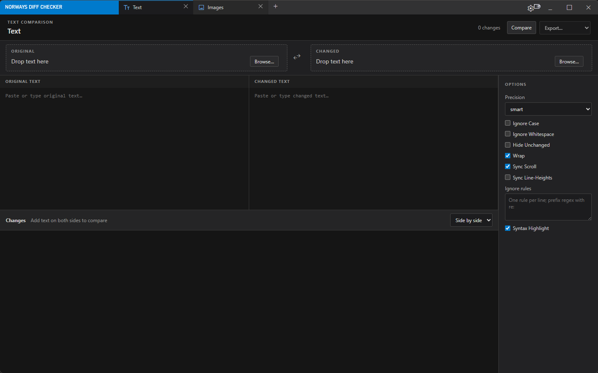

# Norways Diff Checker

A free, open sourced and fully offline & local Diff Checker. Supporting Images, Text, Documents and even Folder comparisons.

## App preview

<table>
	<tr>
		<td width="50%">
			
			<br><strong>Comparison chooser</strong> - Start a new comparison or reopen a recent pair.
		</td>
		<td width="50%">
			
			<br><strong>Text comparison</strong> - Review changes side by side and accept either version.
		</td>
	</tr>
	<tr>
		<td width="50%">
			
			<br><strong>Image comparison</strong> - Inspect images in a split view with threshold controls.
		</td>
		<td width="50%">
			
			<br><strong>Text workspace</strong> - Paste text or browse for files on either side.
		</td>
	</tr>
</table>

## Comparison workspace

- **Text:** pasted or file-backed text and code, side-by-side or unified diff, word and character precision, syntax highlighting, edits, change navigation and acceptance, ignore rules, and PDF/merged-text export.
- **Images:** JPG, PNG, WebP, GIF, HEIC, and PDF pages, multiple overlay views, pixel threshold and region grouping, manual and automatic alignment, perspective adjustment, OCR, EXIF details, scan presets, and PNG export.
- **Documents:** DOCX, PDF, and PPTX pairs, extracted and rendered views, scanned-page and embedded-image OCR, text and structure changes, PDF page ordering, password-protected PDFs, redline decisions, and PDF/DOCX exports.
- **Excel:** XLSX, XLS, CSV, TSV, and ODS pairs, sheet and formula modes, inserted row and column alignment, sorting, date normalization, redline and multi-pane views, PDF and XLSX exports.
- **Folders:** recursive path, metadata, and content-hash comparison, glob exclusions, filters, search, and opening matched file pairs in tabs. Folder sources are read only.

The Welcome chooser opens by default; Settings can restore the previous tabs instead. Drag and drop and Windows Open With populate tabs. Three or more inputs open a pairing chooser. Project files contain snapshots and options; folder projects keep their root paths and scan manifest.

Settings can also add **Compare this file** and **Compare this folder** to Windows Explorer. A cold launch creates a new comparison. An already-running app checks the selected tab in each window, fills a compatible selected tab that has exactly one side populated, or creates a new tab of the input's specific type when no selected tab qualifies.

## App data

The default data folder is `%LOCALAPPDATA%\NorwaysDiffChecker`; the installed app lives in its `app` subfolder. The installer records the data folder in `HKCU\Software\NorwaysDiffChecker\DataPath`. On startup, the app first checks for portable settings beside its executable, then the registry, then the default folder. A portable ZIP includes `portable.flag` so a new portable copy also stores its data beside the executable. Existing preferences and projects from the Electron version remain in the default data folder.

## Build and run

The desktop shell and comparison engine use Rust and Tauri 2. The existing React interface keeps the same visual design. On Windows, install the Rust MSVC toolchain, Microsoft C++ Build Tools, WebView2, and Node.js with npm. From this project directory:

```powershell
npm ci
npm run start
```

To build the portable executable locally:

```powershell
npm run build:app
```

`npm run build:app` writes the executable under `src-tauri/target/release`. On each push to `main`, [the Windows build workflow](.github/workflows/publish-windows.yml) packages it as `Portable.zip`, bundles the app into `Installer.exe`, and publishes those two files in a [GitHub Release](https://github.com/Norway174/Norways-Diff-Checker/releases). Release notes link every commit since the preceding release and show its message and author. The [main installer download](https://github.com/Norway174/Norways-Diff-Checker/releases/latest/download/Installer.exe) points to the latest release. The installer works without a separate portable download.

Each installer is tied to one source commit. Running it normally offers Install, Update, Repair, or Uninstall as applicable. The installed app checks GitHub's latest release API for a newer published build; when idle, it downloads and verifies that release's installer, runs it with `/UPDATE /S`, then relaunches. App data and optional dependencies remain outside the `app` folder during updates. The installer and uninstaller are copied into the app folder for later use.

PDFium, OCR models, and LibreOffice are separate optional downloads in Settings. PDFium is needed for PDF rendering and text extraction; OCR models are needed for image and scanned-page text recognition; LibreOffice is needed for rendered Word and presentation pages. Downloaded dependencies stay in the app data folder and work offline afterward.

The optional PDFium library comes from [pdfium-binaries](https://github.com/bblanchon/pdfium-binaries) and retains its license in `src-tauri/binaries/PDFIUM-LICENSE`. The optional OCR models come from [ocrs](https://github.com/robertknight/ocrs) under CC BY-SA 4.0; see `src-tauri/models/LICENSE.md`. Downloads are pinned to SHA-256 hashes in the app.
